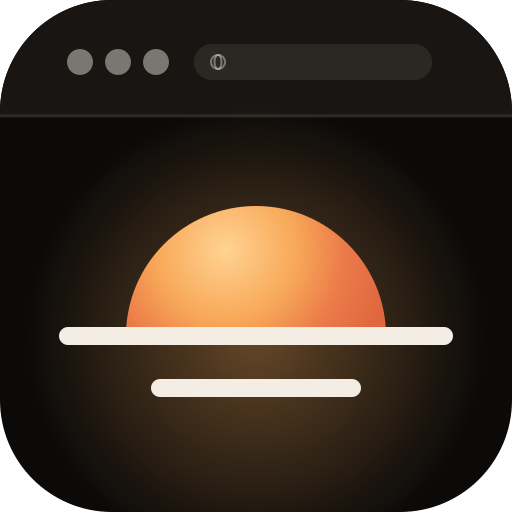
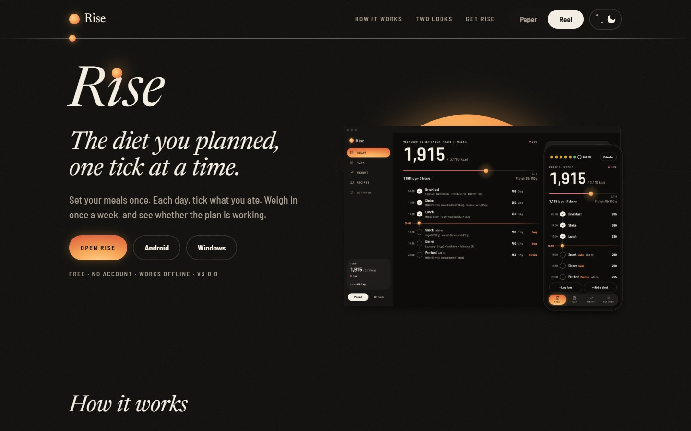
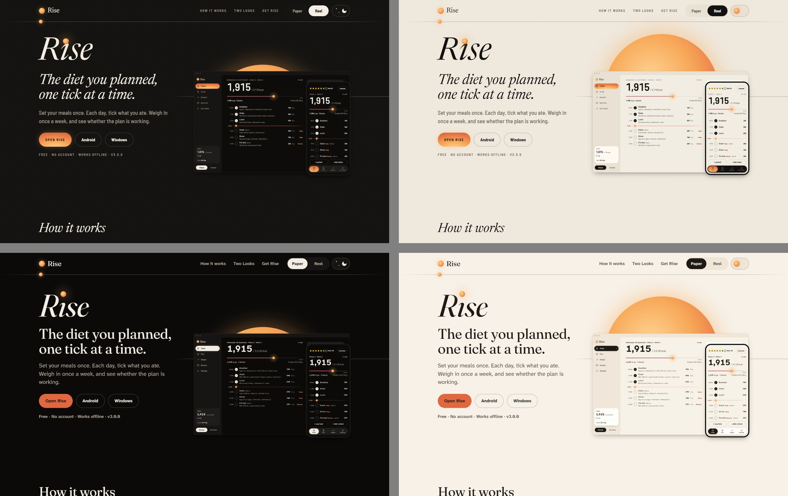
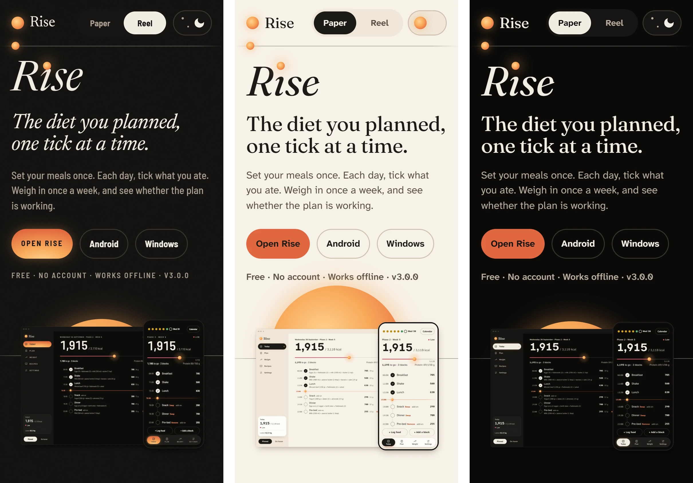

<div align="center">



# Rise, the website

**The diet you planned, one tick at a time.**

The home of [Rise](https://github.com/rvyyv-n/diet-tracker): a diet plan you tick off,<br />
not a food log you feed. Plain HTML, CSS and JS, and nothing that leaves the origin.

[**getrise.pages.dev**](https://getrise.pages.dev) · [The app](https://github.com/rvyyv-n/diet-tracker) · [Privacy](https://getrise.pages.dev/privacy) · [Roadmap](roadmap.md)

[](https://github.com/rvyyv-n/rise-site/actions/workflows/deploy.yml)


</div>

[](https://getrise.pages.dev)

## What's here

One landing page, a privacy page and a 404, ported 1:1 from the Rise design
export. The design is the source of truth: its tokens, fonts, markup, class
names and inline styles are copied as they are, and only its runtime constructs
are replaced with plain HTML.

- **Two Looks, light and dark.** Reel and Paper, each in light and dark, chosen
  by a switch in the header and remembered. The page follows the device until
  you pick, and a blocking script sets the Look before the first paint, so
  nothing flashes.
- **A live Today screen.** The phone in the Today section is real HTML: tick a
  meal, swap one, and the total, the bar and the sun move with it.
- **Real app screens.** The other phones hold screenshots of the app itself,
  cut to the width they show at.
- **Get Rise that knows you.** It tags your platform's card, opens the install
  steps for your browser, and reads the latest release's version, files and
  sizes into the page at build.
- **Motion that stops when you ask it to.** Reveals, a scroll-linked header and
  sun, tilt, and view transitions between Looks. With reduced motion, all of it
  is off.

<div align="center">

[](https://getrise.pages.dev/#looks)

<sub>Reel and Paper, dark and light. The same page, four ways.</sub>

</div>

### On a phone

<div align="center">



</div>

## The rules it keeps

| | |
| --- | --- |
| **Nothing leaves the origin** | No CDNs, font services, analytics, third-party scripts or embeds. The audit counts requests off the origin: 0. |
| **Strict CSP** | `default-src 'self'; script-src 'self'; style-src 'self'; style-src-attr 'unsafe-inline'; img-src 'self' data:`. No inline scripts, `<style>` blocks or `on*=` handlers. |
| **No framework** | Plain HTML, CSS and JS. Vite builds it, in vanilla mode. |
| **Readable** | Text at 4.5:1 or better (two of Reel light's own token pairs fall just under, kept as the design has them), 44px targets, visible focus. |
| **No layout shift** | Sized fallback faces for the font swap. Shift on a throttled link is at most 0.0008. |
| **Fast** | Lighthouse 100 on desktop for all three pages. Mobile is 89 to 97, held back by the hero's reveal stagger. |
| **Small** | Fonts are cut to the Latin set: 384 kB, down from 875 kB, the same pixels. Screens are served by width. |

The design's tokens live in `src/css/tokens.css`, unchanged. There are no hex
values or pixel literals in CSS or JS outside the token files, and a test
holds `site.css` to a ratchet that only goes down.

## Development

Node 24 (see `.nvmrc`).

```sh
npm ci
npm run dev       # Vite dev server
npm test          # literals, headers, fonts, release parsing, screen budgets
npm run build     # build to dist/, then write the latest release into the pages
npm run preview   # serve dist/ on :4173 with the same headers as production
```

The build reads the latest [app release](https://github.com/rvyyv-n/diet-tracker/releases/latest)
from the GitHub API. If it can't, the pages keep the design's values and the
download buttons still point at the latest release.

The checks that need a browser run against `npm run preview`:

```sh
npm run shot            # screenshots in each Look and theme, with layout checks and render diffs
npm run check:looks     # Look and theme behaviour, including no flash
npm run check:motion    # reveals, reduced motion, transitions, the demo
npm run audit           # requests, contrast, targets, shift, Lighthouse, screens
npm run check:headers -- https://getrise.pages.dev
```

Two scripts are for maintainers and rarely run. `npm run fonts` cuts the faces
to the Latin set and needs Python with `fonttools` and `brotli`.
`npm run demo:markup` writes the live Today phone from the design, and needs
the design export, which is not in the repo.

## How it's laid out

| Path | Holds |
| --- | --- |
| `index.html`, `privacy.html`, `404.html` | The three pages, Vite's inputs |
| `src/css/` | `index.css`, which imports in cascade order: `tokens.css` (the design's, unchanged), `site-tokens.css`, `page.css` for what the port adds, and `site.css` |
| `src/js/` | Look and theme, reveals, scroll and hero motion, view transitions, the Get Rise install card, and the live Today demo |
| `public/js/head.js` | The blocking script that sets the Look and theme before the first paint |
| `public/_headers` | The CSP and other headers, served by Cloudflare Pages and by `vite preview` |
| `public/assets/` | Fonts (with their licences), the app screens as WebP, the icon and the Open Graph card |
| `scripts/` | Build, release, screenshot, check and audit scripts |
| `tests/` | Unit tests |
| `dev/states.html` | Dev-only page of the design's states, not built |

[`roadmap.md`](roadmap.md) has the plan, what each build pass did, and the notes
a new contributor needs.

## Deploying

The site is static and goes to Cloudflare Pages (project `getrise`).
[`deploy.yml`](.github/workflows/deploy.yml) tests and builds every push to `main`
and every pull request (changes to docs alone are skipped), and deploys `main`
once the `CLOUDFLARE_API_TOKEN` and `CLOUDFLARE_ACCOUNT_ID` secrets exist. It also
accepts a `rise-release` dispatch from the app repo, so a release can refresh the
version on the download buttons. Until then, deploy by hand:

```sh
npm run build
npx wrangler pages deploy dist --project-name=getrise --branch=main
```

## Fonts

Barlow Semi Condensed, Fraunces, Newsreader and Atkinson Hyperlegible Next, each
under the SIL Open Font License. The licences are in `public/assets/fonts/`.
